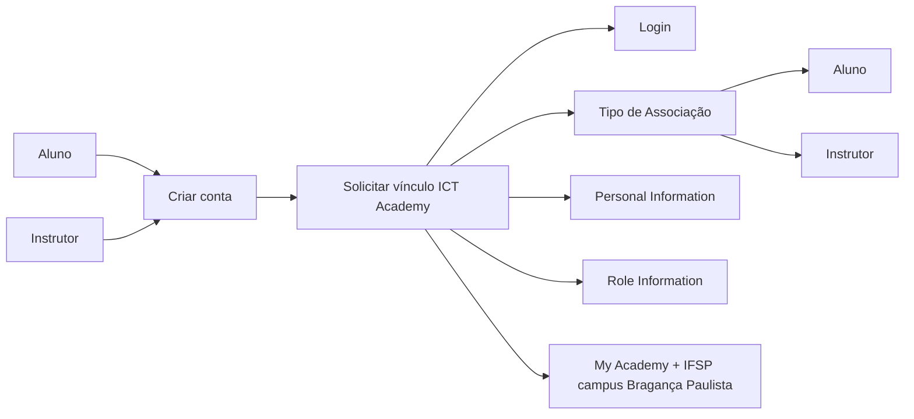
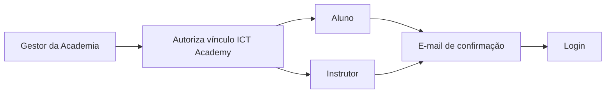
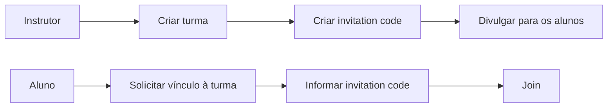

# Documentação de suporte - Huawei ICT Academy

### Considerações iniciais:

- O presente repositório foi criado com o objetivo de reunir documentação de suporte voltada ao uso cotidiano da plataforma Huawei Talent, pertencente ao programa Huawei ICT Academy;
-   Tais recursos serão disponibilizados sob demanda, de acordo com os materiais oficiais fornecidos pelo programa, ou ainda, por meio da confecção de FAQs de autoria própria;
- Os principais links de acesso citados na documentação de suporte, podem ser encontrados na tabela, conforme à seguir:

### Links importantes:

| Tipo            | Descrição                      | URL                 |
|:----------------|:-------------------------------|:-----------------------------|
|Huawei ICT Academy|Página principal do programa.|https://e.huawei.com/en/talent/ict-academy/#/home|
|Become an ICT Academy|Como se tornar uma Huawei ICT Academy.|https://partner.huawei.com/eplus/#/en/web/become-an-ict-academy-en|
|Become Instructor|Como se tornar um instrutor autorizado.|https://e.huawei.com/en/talent/#/ict/become-ict-teacher|
|Become Student|Como se tornar um estudante.|https://e.huawei.com/en/talent/ict-academy/#/become-ict-student|
|Documentation Center|Documentação oficial de apoio aos cursos.|https://e.huawei.com/en/talent/#/resources?tabKey=3|
|Huawei ICT Academy Course Catalog|Catálogo de treinamentos disponíveis.|https://e.huawei.com/en/talent/ict-academy/#/ict-courses-list|

### Primeiros passos:

- Para que alunos e instrutores possam consumir o conteúdo da plataforma, são necessários três passos, à saber:

1. Criação de um usuário na plataforma:

2. Vínculo à uma ICT Academy ativa:

3. Matrícula no treinamento desejado:

- No diretório "manuais", são disponibilizados roteiros em pt-BR com material didático em formato PDF que trazem em detalhes as principais informações necessárias para que alunos e instrutores possam vincular-se a uma Huawei ICT Academy ativa. Uma breve descrição do propósito de cada um dos documento disponíveis pode ser encontrada na tabela abaixo: 

| Tipo            | Descrição                      | Variações                 |
|:----------------|:-------------------------------|:-----------------------------|
|Guia de Operação do Administrador|Orientações sistêmicas voltadas aos administradores locais das Huawey ICT Academies.|Não há.|
|Manual de Criação de Turma|Apresenta o processo de criação de turmas pelo instrutor na plataforma Huawei Talent.|Não há.|
|Manual de Ingresso de Aluno na Turma|Traz o passo a passo para que o aluno possa ingressar em turmas vigentes na plataforma Huawei Talent.|Não há.|
|Manual de Registro|Procedimentos necessários para registro de alunos e instrutores na plataforma Huawei Talent.|Alunos ou Instrutores.|
|Manual de Solicitação HCAI|Documenta os passos necessários para o processo de solicitação da certificação HCAI - Huawei Certified Academy Instrutor.|Não há.|
