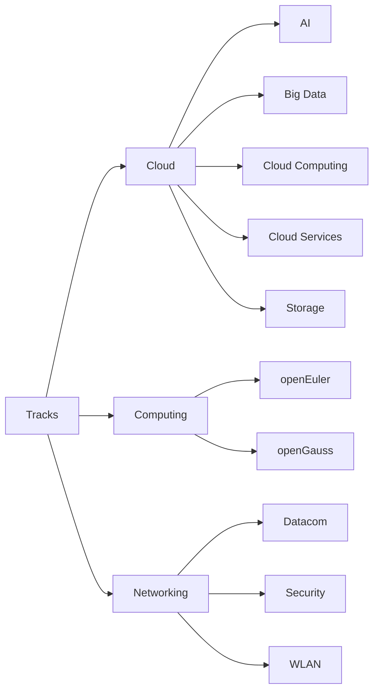

# Materiais para estudo  offline - Huawei ICT Competition

### Principais considerações:

- Os arquivos estão organizados por tracks em um primeiro nível e por curso, no segundo:

- O "Exam Outline" de cada trilha segue as recomendações da competição do ano passado, mas acredito que se eventualmente ocorrerem mudanças, serão muito pequenas;
- Os PDFs com materiais didáticos podem possuir duas versões a depender do curso e os demais arquivos seguem uma estrutura comum, conforme à seguir: 

|                | Descrição                      | Recomendação                 |
|----------------|:-------------------------------|:-----------------------------|
|Lab Guides|Roteiros para atividades práticas que farão sentido na Final LATAM e Global.|Por enquanto não se preocupem com eles.|
|Learning Guides|Referentes aos cursos da plataforma, mas contém muito mais informações e aprofundamento.|Leitura altamente recomendada para aprofundamento nos tópicos.|
|Mock Exams|Arquivo TXT presente em cada um dos diretórios de cursos que aponta para um link que deve servir como simulado.|Reservem esse recurso para o momento em que se considerarem devidamente preparados, pois só é possível realizar cada Mock uma única vez.|
|Training Materials|Correspondem aos slides utilizados no curso da plataforma, com alguns comentários extra no rodapé.|Utilizem como guia de consulta rápida.|
|Release Notes|Documentam eventuais mudanças da versão atual do treinamento em questão para as anteriores ou imediatamente anterior.|Funciona como um changelog.|
